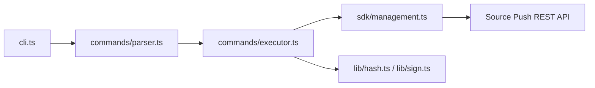

# Architecture

## Overview

## Entry points

| File | Role |
|------|------|
| `src/cli.ts` | Parses argv via yargs, calls `execute()` |
| `src/index.ts` | Re-exports `AccountManager` for programmatic use |
| `dist/cli.js` | Published npm bin (`srcpush`) |
| `dist/index.js` | Published SDK entry |

## Command flow

1. **Parser** (`commands/parser.ts`) — yargs definitions map argv → `ICommand` objects (`types/cli.ts`).
2. **Executor** (`commands/executor.ts`) — dispatches by `CommandType`, formats output, handles confirmations.
3. **Management SDK** (`sdk/management.ts`) — HTTP via superagent to the Source Push API.
4. **Acquisition SDK** (`sdk/acquisition.ts`) — client-side update check protocol (used by RN plugin, also exported).

## `runtime` object

`commands/executor.ts` exports a `runtime` object (`sdk`, `log`, `spawn`, `confirm`, `createEmptyTempReleaseFolder`, `release`) so tests can stub dependencies without fighting ESM live bindings.

## Build

Vite compiles TypeScript to **CommonJS** with `preserveModules: true` into `dist/`. The shebang in `cli.ts` is preserved in `dist/cli.js`.

## Hash integrity

Package hashing in `src/lib/hash.ts` is duplicated in the API service for server-side validation. Keep both implementations aligned.
